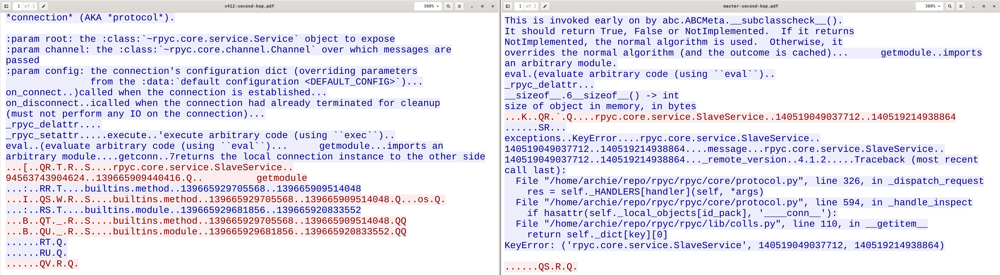

.. _advdebugging:

Advanced Debugging
==================

A guide to using Wireshark when debugging complex use such as chained-connections.

Tips and Tricks
---------------
Setting up for a specific version ::

    pkgver=4.0.2
    myvenv=rpyc${pkgver}
    virtualenv2 /tmp/$myvenv
    source /tmp/$myvenv/bin/activate
    pip install rpyc==$pkgver

Display filtering for Wireshark ::

    tcp.port == 18878 || tcp.port == 18879
    (tcp.port == 18878 || tcp.port == 18879) && tcp.segment_data contains "rpyc.core.service.SlaveService"

Running the chained-connection unit test ::

    cd tests
    python  -m unittest test_get_id_pack.Test_get_id_pack.test_chained_connect

After stopping Wireshark, export specified packets, and open the PCAP. If not already configured, add a custom display column: ::

    Title,        Type,   Fields,     Field Occurrence
    Stream Index, Custom, tcp.stream, 0

The stream index column makes it easier to decide which TCP stream to follow. Following a TCP provides a more human readable overview
of requests and replies that can be printed as a PDF.

