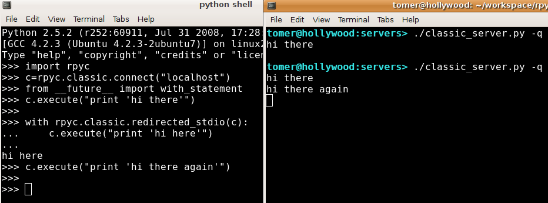
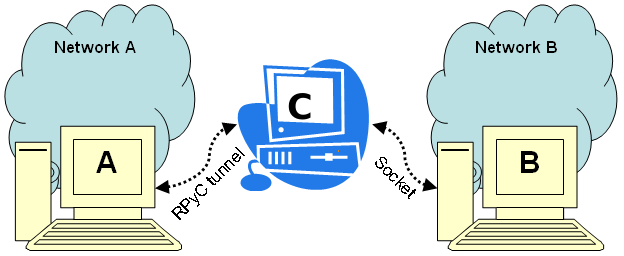

.. _howto:

How To's
========

This page contains a collection of useful concepts and examples for developing with RPyC

Redirecting Standard Input/Output
---------------------------------
You can "rewire" ``stdin``, ``stdout`` and ``stderr`` between RPyC hosts. For example,
if you want to "forward" the ``stdout`` of a remote process to your local ``tty``,
you can use the following receipt::

    >>> import rpyc
    >>> c = rpyc.classic.connect("localhost")
    >>> c.execute("print 'hi there'")   # this will print on the host
    >>> import sys
    >>> c.modules.sys.stdout = sys.stdout
    >>> c.execute("print 'hi here'")   # now this will be redirected here
    hi here

Also note that if you are using classic mode RPyC, you can use the
`context manager <http://www.python.org/doc/2.5.2/lib/typecontextmanager.html>`_
``rpyc.classic.redirected_stdio``::

    >>> c.execute("print 'hi there'")                   # printed on the server
    >>>
    >>> with rpyc.classic.redirected_stdio(c):
    ...     c.execute("print 'hi here'")                # printed on the client
    ...
    hi here
    >>> c.execute("print 'hi there again'")             # printed on the server
    >>>

   A screenshot of an RPyC client redirecting standard output from the server to
   its own console.

Debugging
---------
If you are using the classic mode, you will be glad to know that you can debug remote
exceptions with ``pdb``:

    >>> c = rpyc.classic.connect("localhost")
    >>> c.modules["xml.dom.minidom"].parseString("<<invalid xml>/>")
    ======= Remote traceback =======
    Traceback (most recent call last):
    ...
      File "/usr/lib/python2.5/xml/dom/minidom.py", line 1925, in parseString
        return expatbuilder.parseString(string)
      File "/usr/lib/python2.5/xml/dom/expatbuilder.py", line 940, in parseString
        return builder.parseString(string)
      File "/usr/lib/python2.5/xml/dom/expatbuilder.py", line 223, in parseString
        parser.Parse(string, True)
    ExpatError: not well-formed (invalid token): line 1, column 1
    ...
      File "/home/tomer/workspace/rpyc/core/protocol.py", line 298, in sync_request
        raise obj
    xml.parsers.expat.ExpatError: not well-formed (invalid token): line 1, column 1
    >>>
    >>> rpyc.classic.pm(c) # start post-portem pdb
    > /usr/lib/python2.5/xml/dom/expatbuilder.py(226)parseString()
    -> pass
    (Pdb) l
    221             parser = self.getParser()
    222             try:
    223                 parser.Parse(string, True)
    224                 self._setup_subset(string)
    225             except ParseEscape:
    226  ->             pass
    227             doc = self.document
    228             self.reset()
    229             self._parser = None
    230             return doc
    231
    (Pdb) w
    ...
      /home/tomer/workspace/rpyc/core/protocol.py(381)_handle_call()
    -> return self._local_objects[oid](*args, **dict(kwargs))
      /usr/lib/python2.5/xml/dom/minidom.py(1925)parseString()
    -> return expatbuilder.parseString(string)
      /usr/lib/python2.5/xml/dom/expatbuilder.py(940)parseString()
    -> return builder.parseString(string)
    > /usr/lib/python2.5/xml/dom/expatbuilder.py(226)parseString()
    -> pass
    (Pdb)

Tunneling
---------
Many times, especially in testing environments, you have subnets, VLANs, VPNs, firewalls
etc., which may prevent you from establishing a direct TCP connection between two
machines, crossing network  in two different networks. This may be done for security reasons or to simulate
the environment where your product will be running, but it also hinders your ability to
conduct tests. However, with RPyC you can overcome this limitation very easily:
simply use the remote machine's ``socket`` module!

Consider the following diagram:

Machine ``A`` belongs to network ``A``, and it wants to connect to machine ``B``, which
belongs to network ``B``. Assuming there's a third machine, ``C`` that has access to both
networks (for instance, it has multiple network cards or it belongs to multiple VLANs),
you can use it as a transparent bridge between machines ``A`` and ``B`` very easily: simply
run an RPyC server on machine ``C``, to which machine ``A`` would connect, and use its
``socket`` module to connect to machine ``B``. It's really simple::

    # this runs on machine `A`
    import rpyc

    machine_c = rpyc.classic.connect("machine-c")
    sock = machine_c.modules.socket.socket()
    sock.connect(("machine-b", 12345))

    sock.send(...)
    sock.recv(...)

Monkey-Patching
---------------
If you have python modules that make use of the ``socket`` module (say, ``telnetlib``
or ``asyncore``), and you want them to be able to cross networks over such a bridge,
you can use the recipe above to "inject" ``C``'s socket module into your third-party module,
like so::

    import rpyc
    import telnetlib

    machine_c = rpyc.classic.connect("machine-c")
    telnetlib.socket = rpyc.modules.socket

This is called `monkey-patching <http://en.wikipedia.org/wiki/Monkey_patch>`_, it's a very
handy technique which you can use in other places as well, to override functions, classes
and entire modules. For instance ::

    import mymodule
    import rpyc
    # ...
    mymodule.os = conn.modules.os
    mymodule.open = conn.builtins.open
    mymodule.Telnet = conn.modules.telnetlib.Telnet

That way, when ``mymodule`` makes use of supposedly local modules, these modules
actually perform operations on the remote machine, transparently.

