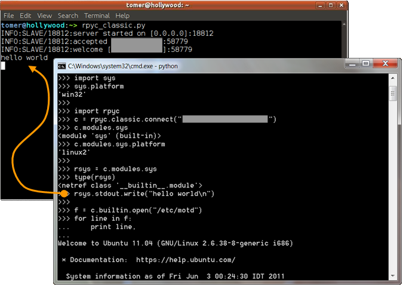

.. raw:: html

    

    <strong>Quick Links</strong> 
    <ul>
    <li><a href="#getting-started" title="Jump to download">Download</a></li>
    <li><a href="tutorial.html" title="Tutorial">Tutorial</a></li>
    <li><a href="docs.html" title="User guide">User Guide</a></li>
    <li><a href="api.html" title="API reference">API Reference</a></li>
    <li><a href="#contents" title="Jump to Table of Contents">ToC</a></li>
    </ul>
    

    <a href="http://tomerfiliba.com" target="_blank">
    
    Tomer Filiba</a>
     
    
     
    
    

RPyC - Transparent, Symmetric Distributed Computing
====================================================
.. raw:: html

   

   <strong>Sticky</strong> 

   
 2017.07.26:
   <a class="reference external" href="https://pypi.python.org/pypi/rpyc/3.4.4">Version 3.4.4</a> has been released!.
   More info on the <a href="http://rpyc.readthedocs.org/en/latest/changelog.html">changelog</a>
   

   
Please use the
   <a class="reference external" href="https://github.com/tomerfiliba/rpyc/issues">github issues</a>
   to ask questions report problems. <strong>Please do not email me directly</strong>.

   

**RPyC** (pronounced as *are-pie-see*), or *Remote Python Call*, is a **transparent**
`python <http://www.python.org>`_ library for **symmetrical**
`remote procedure calls <http://en.wikipedia.org/wiki/Remote_procedure_calls>`_,
`clustering <http://en.wikipedia.org/wiki/Clustering>`_ and
`distributed-computing <http://en.wikipedia.org/wiki/Distributed_computing>`_.
RPyC makes use of `object-proxying <http://en.wikipedia.org/wiki/Proxy_pattern>`_,
a technique that employs python's dynamic nature, to overcome the physical boundaries
between processes and computers, so that remote objects can be manipulated as if
they were local.

   A screenshot of a Windows client connecting to a Linux server. Note that text written
   to the server's ``stdout`` is actually printed on the server's console.

Getting Started
---------------
:ref:`Installing <install>` RPyC is as easy as ``pip install rpyc``.

If you're new to RPyC, be sure to check out the :ref:`tutorial` and
:ref:`screencasts`. Next, refer to the :ref:`documentation` and :ref:`api-ref`,
as well as the :ref:`mailing-list`.

For an introductory reading, `David Mertz <http://gnosis.cx/dW/>`_ wrote a very thorough
`Charming Python <http://www.ibm.com/developerworks/linux/library/l-rpyc/>`_ installment
about RPyC, explaining how it's different from existing alternatives (Pyro, XMLRPC, etc.),
what roles it can play, and even show-cases some key features of RPyC (like the security model,
remote monkey-patching, or remote resource utilization).

Features
--------
* **Transparent** - access to remote objects as if they were local; existing
  code works seamlessly with both local or remote objects.

* **Symmetric** - the protocol itself is completely symmetric, meaning both
  client and server can serve requests. This allows, among other things, for the
  server to invoke `callbacks <http://en.wikipedia.org/wiki/Callback_(computer_science)>`_
  on the client side.

* **Synchronous** and :ref:`asynchronous <async>` operation

* **Platform Agnostic** - 32/64 bit, little/big endian, Windows/Linux/Solaris/Mac...
  access objects across different architectures.

* **Low Overhead** - RpyC takes an *all-in-one* approach, using a compact binary
  protocol, and requiring no complex setup (name servers, HTTP, URL-mapping, etc.)

* **Secure** - employs a `Capability based <http://en.wikipedia.org/wiki/Capability-based_security>`_
  security model; intergrates easily with SSH

* **Zero-Deploy Enabled** -- Read more about :ref:`Zero-Deploy RPyC <zerodeploy>`

* **Integrates** with `TLS/SSL <http://en.wikipedia.org/wiki/Transport_Layer_Security>`_,
  `SSH <http://en.wikipedia.org/wiki/Secure_Shell>`_ and `inetd <http://en.wikipedia.org/wiki/inetd>`_.

Use Cases
---------
* Excels in testing environments -- run your tests from a central machine offering a convenient
  development environment, while the actual operations take place on remote ones.

* Control/administer multiple hardware or software platforms from a central point: any machine
  that runs Python is at your hand! No need to master multiple shell-script languages (BASH,
  Windows batch files, etc.) and use awkward tools (``awk``, ``sed``, ``grep``, ...)

* Access remote hardware resources transparently. For instance, suppose you have some proprietary
  electronic testing equipment that comes with drivers only for HPUX, but no one wants to
  actually use HPUX... just connect to the machine and use the remote ``ctypes`` module (or open
  the ``/dev`` file directly).

* `Monkey-patch <http://en.wikipedia.org/wiki/Monkey_patch>`_ local code or remote code.
  For instance, using monkey-patching you can cross network boundaries by replacing the
  ``socket`` module of one program with a remote one. Another example could be replacing the
  ``os`` module of your program with a remote module, causing ``os.system`` (for instance) to
  run remotely.

* Distributing workload among multiple machines with ease

* Implement remote services (like `WSDL <http://en.wikipedia.org/wiki/WSDL>`_
  or `RMI <http://en.wikipedia.org/wiki/Java_remote_method_invocation>`_)
  quickly and concisely (without the overhead and limitations of these technologies)

Contents
--------
.. toctree::
   :maxdepth: 1

   install
   license
   changelog

.. toctree::

   tutorial
   screencasts
   docs
   api
   whatsnew33

