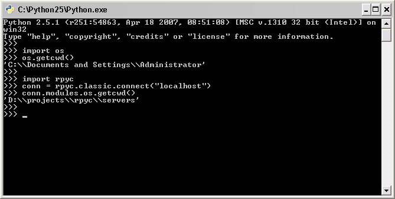

.. _tut1:

Part1: Introduction to *Classic RPyC*
=====================================

We'll kick-start the tutorial with what is known as *classic-style* RPyC, i.e., the
methodology of RPyC 2.60. Since RPyC 3 is a complete redesign of the library, there are some
minor changes, but if you were familiar with RPyC 2.60, you'll feel right at home. And even
if you were not -- we'll make sure you feel at home in a moment ;)

Running a Server
----------------
Let's start with the basics: running a server. In this tutorial we'll run both the server and
the client on the same machine (the ``localhost``). The classic server can be
started using::

    $ python bin/rpyc_classic.py
    INFO:SLAVE/18812:server started on [0.0.0.0]:18812

On windows, the server can be started by double-clicking the script file.

The first (and only) line shows the parameters this server is running with: ``SLAVE``
indicates the ``SlaveService`` (you'll learn more about :ref:`services <services>` later on),
``tid`` is the thread ID (``tid`` if server is threaded, ``pid`` if it is forking),
and ``0.0.0.0:18812`` is the address on which the server binds.

Running a Client
----------------
The next step is running a client which connects to the server. The code needed to create a
connection to the server is quite simple, you'd agree ::

    import rpyc
    conn = rpyc.classic.connect("localhost")

.. note::
   Of course you will need to change ``localhost`` to reflect the name of your RPyC host.
   If your server is not running on the default port (``TCP 18812``), you'll have to
   pass the ``port =`` parameter to :func:`~rpyc.utils.classic.connect`.

The ``modules`` Namespace
-------------------------
That's about it, you are now connected to the server and ready to control it: say hello
to ``modules``! The ``modules`` property of connection objects exposes the server's
module-space, i.e., it lets you access remote modules with ease. Here's how::

    # dot notation
    mod1 = conn.modules.sys # access the sys module on the server

    # bracket notation
    mod2 = conn.modules["xml.dom.minidom"] # access the xml.dom.minidom module on the server

.. note::
  There are two ways to access remote modules, the more intuitive but limited
  *dotted notation* and the more powerful and explicit  *bracket notation*.
  The dotted notation is works only with top-level modules or packages, but should you
  require access to deeper level modules (e.g., ``xml.dom.minidom``), use the bracket notation.

  Throughout this tutorial, we'll normally only require the dotted notation.

And now for a short demo:

   A sample client

The first section in the above screenshot prints the current working directory of my
interpreter. Nothing fancy here. But as you can see, two lines below, I'm invoking
``os.getcwd()`` on the server... It's that simple!

Continue to :ref:`part 2 <tut2>`...

