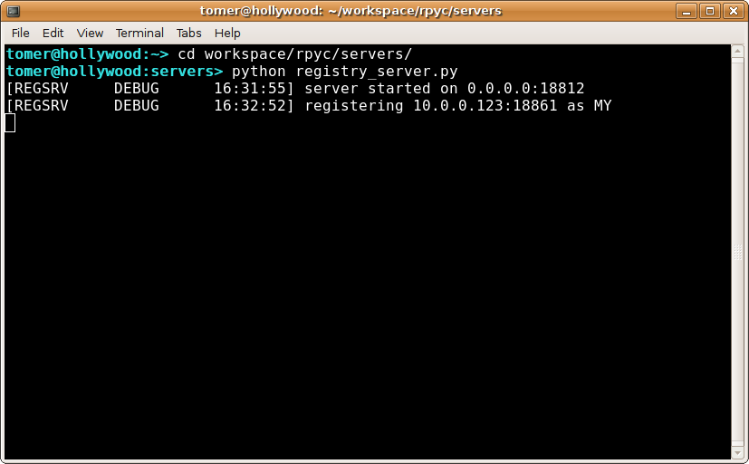

.. _tut3:

Part 3: Services and *New Style* RPyC
=====================================

So far we have covered the features of classic RPyC. However, the new model of RPyC
programming (starting with RPyC 3.00), is based on *services*. As you might have noticed
in the classic mode, the client basically gets full control over the server, which is
why we (used to) call RPyC servers *slaves*. Luckily, this is no longer the case.
The new model is *service oriented*: services provide a way to expose a well-defined set
of capabilities to the other party, which makes RPyC a generic RPC platform. In fact, the
*classic RPyC* that you've seen so far, is simply "yet another" service.

Services are quite simple really. To prove that, the ``SlaveService`` (the service that
implements classic RPyC) is only 30 lines long, including comments ;). Basically, a service
has the following boilerplate::

    import rpyc

    class MyService(rpyc.Service):
        def on_connect(self):
            # code that runs when a connection is created
            # (to init the serivce, if needed)
            pass

        def on_disconnect(self):
            # code that runs when the connection has already closed
            # (to finalize the service, if needed)
            pass

        def exposed_get_answer(self): # this is an exposed method
            return 42

        def get_question(self):  # while this method is not exposed
            return "what is the airspeed velocity of an unladen swallow?"

As you can see, apart from the special initialization/finalization methods, you are free
to define the class like any other class. Unlike regular classes, however, you can
choose which attributes will be exposed to the other party: if the name starts
with ``exposed_``, the attribute will be remotely accessible, otherwise it is only
locally accessible. In this example, clients will be able to call ``get_answer``,
but not ``get_question``, as we'll see in a moment.

.. note::
    The server creates a ``Service`` object for every instance. This means
    that instance variables are not shared between different clients. If you
    do need shared state, you have to use globals or subclass the ``Server``
    class to pass additional variables to new ``Service`` objects.

To expose your service to the world, however, you will need to start a server. There are many
ways to do that, but the simplest is ::

    # ... continuing the code snippet from above ...

    if __name__ == "__main__":
        from rpyc.utils.server import ThreadedServer
        t = ThreadedServer(MyService, port = 18861)
        t.start()

To the remote party, the service is exposed as the root object of the connection, e.g.,
``conn.root``. Now you know all you need to understand this short demo:

    >>> import rpyc
    >>> c = rpyc.connect("localhost", 18861)
    >>> c.root     # this is the "root object", i.e., the service that is exposed to this client
    <__main__.MyService object at 0x834e1ac>
    >>>
    >>> c.root.get_answer
    <bound method MyService.exposed_get_answer of <__main__.MyService object at 0x834e1ac>>
    >>> c.root.get_answer()
    42
    >>> c.root.exposed_get_answer()    # it can be accessed with the 'exposed_' prefix as well
    42
    >>> c.root.get_question()   # but "get_question" is not exposed!
    ======= Remote traceback =======
    ...
      File "/home/tomer/workspace/rpyc/core/protocol.py", line 298, in sync_request
        raise obj
    AttributeError: cannot access 'get_question'

But Wait, There's More!
-----------------------
All services have a //name//, which is normally the name of the class, minus the
``"Service"`` suffix. In our case, the service name is ``"MY"`` (service names are
case-insensitive). If you wish to define a custom name, or multiple names (aliases),
you can do so by setting the ``ALIASES`` list. The first alias is considered to be the
"formal name", while the rest are aliases::

    class SomeOtherService(rpyc.Service):
        ALIASES = ["floop", "bloop"]
        ...

In the original code snippet, this is what the client gets::

    >>> c.root.get_service_name()
    'MY'
    >>> c.root.get_service_aliases()
    ('MY',)

The reason services have names is for the **service registry**: normally, a server will
broadcast its details to a nearby :ref:`registry server <registry-server>` for discovery.
To use service discovery, a make sure you start the ``registry_server.py`` that comes in
the ``rpyc/scripts`` directory. This server listens on a broadcast UDP socket, and will
answer to queries about  which services are running where.

Once a registry server is running somewhere "broadcastable" on your network, and the
servers are configured to auto-register with it (the default), clients can discover
services *automagically*::

    >>> rpyc.discover("MY")      # to find servers running a given service name
    (('192.168.1.101', 18861),)

    # and if you don't care to which you server you connect, you use connect_by_service:
    >>> c2 = rpyc.connect_by_service("MY")
    >>> c2.root.get_answer()
    42

Decoupled Services
------------------
So far we've discussed only about the service that the **server** exposes, but what about
the client? Does the client expose a service too? After all, RPyC is a symmetric protocol --
there's no difference between the client and the server. Well, as you might have guessed,
the answer is yes: both client and server expose services. However, the services exposed
by the two parties need not be the same -- they are **decoupled**.

By default, clients (using one of the ``connect()`` functions to connect to a server)
expose the ``VoidService``. As the name suggests, this service exposes no functionality to the
other party, meaning the server can't make requests to the client (except for explicitly
passed capabilities, like function callbacks). You can set the service exposed by the client
by passing the ``service =`` parameter to one of the :func:`~rpyc.utils.factory.connect`
functions.

The fact that the services on both ends of the connection are decoupled, does not mean
they can be arbitrary. For instance, "service A" might expect to be connected to "service B" --
and runtime errors (mostly ``AttributeError``) will ensue if this not the case. Many times the
services on both ends can be different, but do keep it in mind that if you need interaction
between the parties, both services must be "compatible".

.. note::
   **Classic mode:** when using any of the :func:`~rpyc.utils.classic.connect` functions,
   the client-side service is set to ``SlaveService`` as well (being identical to the server).

Continue to :ref:`part 4 <tut4>`...
