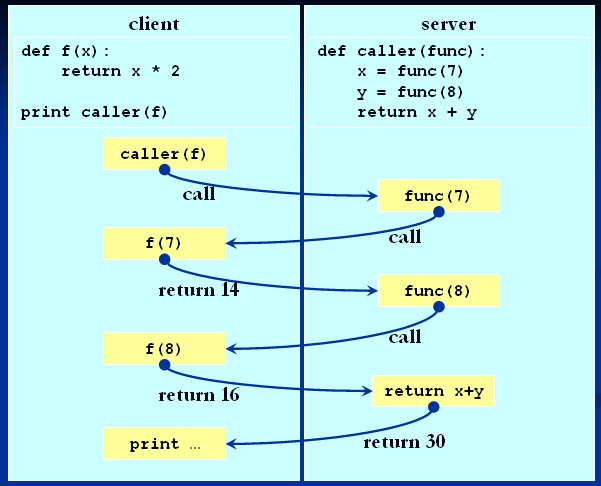

.. _tut4:

Part 4: Callbacks and Symmetry
==============================
Before we dive into asynchronous invocation, we have to cover once last topic:
`callbacks <http://en.wikipedia.org/wiki/Callback_(computer_science)>`_. Passing a
"callback function" means treating functions (or any callable objects in our case) as
`first-class objects <http://en.wikipedia.org/wiki/First-class_object>`_, i.e., like any
other value in the language. In ``C`` and ``C++`` this is done with
`function pointers <http://en.wikipedia.org/wiki/Function_pointer>`_, but in python,
there's no special machinery for it. Surely you've seen callbacks before::

    >>> def f(x):
    ...     return x**2
    ...
    >>> map(f, range(10))   # f is passed as an argument to map
    [0, 1, 4, 9, 16, 25, 36, 49, 64, 81]

Since in python functions (as well as any other value) are objects, and since RPyC is
symmetrical, local functions can be passed as arguments to remote objects, and vice versa.
Here's an example ::

    >>> import rpyc
    >>> c = rpyc.classic.connect("localhost")
    >>> rlist = c.modules.__builtin__.range(10) # this is a remote list
    >>> rlist
    [0, 1, 2, 3, 4, 5, 6, 7, 8, 9]
    >>>
    >>> def f(x):
    ...     return x**3
    ...
    >>> c.modules.__builtin__.map(f, rlist)  # calling the remote map with the local function f as an argument
    [0, 1, 8, 27, 64, 125, 216, 343, 512, 729]
    >>>

    # and to better understand the previous example
    >>> def g(x):
    ...     print "hi, this is g, executing locally", x
    ...     return x**3
    ...
    >>> c.modules.__builtin__.map(g, rlist)
    hi, this is g, executing locally 0
    hi, this is g, executing locally 1
    hi, this is g, executing locally 2
    hi, this is g, executing locally 3
    hi, this is g, executing locally 4
    hi, this is g, executing locally 5
    hi, this is g, executing locally 6
    hi, this is g, executing locally 7
    hi, this is g, executing locally 8
    hi, this is g, executing locally 9
    [0, 1, 8, 27, 64, 125, 216, 343, 512, 729]
    >>>

To explain what the symmetry of RPyC means, consider the following diagram:

As you can see, while the client is waiting for the result (a synchronous request),
it will serve all incoming requests, meaning the server can invoke the callback it had
received on the client. In other words, the symmetry of RPyC means that both the client and
the server are ultimately "servers", and the "role" is more semantic than programmatic.

Continue to :ref:`part 5 <tut5>`...

