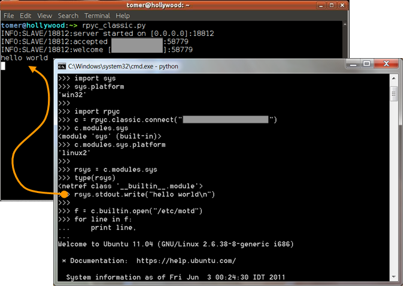

.. toctree::
   :hidden:

   install
   tutorial
   screencasts

   docs
   api

Welcome
=======
**RPyC** (`IPA: <http://en.wikipedia.org/wiki/IPA_for_English>`_ /ɑɹ paɪ siː/,
pronounced like *are-pie-see*), or *Remote Python Call*, is a **transparent**
`python <http://www.python.org>`_ library for **symmetrical**
`remote procedure calls <http://en.wikipedia.org/wiki/Remote_procedure_calls>`_,
`clustering <http://en.wikipedia.org/wiki/Clustering>`_ and
`distributed-computing <http://en.wikipedia.org/wiki/Distributed_computing>`_.
RPyC makes use of `object-proxying <http://en.wikipedia.org/wiki/Proxy_pattern>`_,
a technique that employs python's dynamic nature, to overcome the physical boundaries
between processes and computers, so that remote objects can be manipulated as if
they were local.

   
   A screenshot of a Windows client connecting to a Linux server.
   
   Note that text written to the server's ``stdout`` is actually printed on 
   the server's console.

Getting Started
---------------
:ref:`Installing <install>` RPyC is as easy as ``easy_install rpyc``.

If you're new to RPyC, be sure to check out the :ref:`tutorial` and
:ref:`screencasts`. Next, refer to the :ref:`documentation` and :ref:`api-ref`,
as well as the :ref:`mailing-list`.

Features
--------
* **Transparent** - access to remote objects as if they were local; existing
  code works seamlessly with both local or remote objects.

* **Symmetric** - the protocol itself is completely symmetric, meaning both
  client and server can serve requests. This allows, among other things, for the
  server to invoke `callbacks <http://en.wikipedia.org/wiki/Callback_(computer_science)>`_
  on the client side.

* **Synchronous** and :ref:`asynchronous <async>` operation

* **Platform Agnostic** - 32/64 bit, little/big endian, Windows/Linux/Solaris/Mac...
  access objects across different architectures.

* **Low Overhead** - RpyC takes an *all-in-one* approach, using a compact binary
  protocol, and requiring no complex setup (name servers, HTTP, URL-mapping, etc.)

* **Secure** - employs a `Capability based <http://en.wikipedia.org/wiki/Capability-based_security>`_
  security model

* **Integrates** with `TLS/SSL <http://en.wikipedia.org/wiki/Transport_Layer_Security>`_,
  `SSH <http://en.wikipedia.org/wiki/Secure_Shell>`_ and `inetd <http://en.wikipedia.org/wiki/inetd>`_.

Use Cases
---------
* Excels in testing environments

* Control multiple hardware or software platforms from a central point

* Access remote hardware resources transparently

* Distribute workload among multiple machines with ease

* Implement remote services (like `WSDL <http://en.wikipedia.org/wiki/WSDL>`_
  or `RMI <http://en.wikipedia.org/wiki/Java_remote_method_invocation>`_)
  quickly and concisely (without the overhead and limitations of these technologies)

